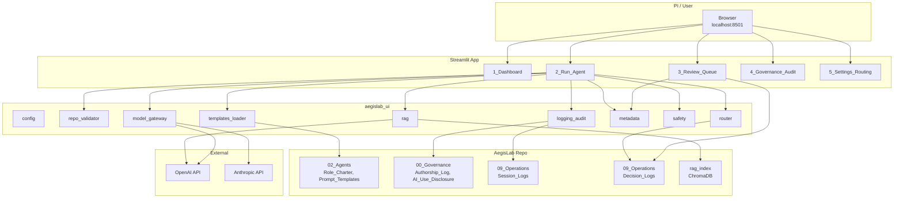

# AegisLab Environment — Architecture View

**Scope:** The virtual research laboratory (repo structure, operational console, agents, LLM gateway, governance, and RAG). Distinct from the praxis artifact *detection pipeline* in `System_Architecture_v1.md`.

**See also:** [09_Operations/Agentic_Environment_Workflow_View.md](../../09_Operations/Agentic_Environment_Workflow_View.md) — full workflow view of the entire agentic AI environment (all entry points, 11 agents, data flow).

**Last Updated:** 2025-02-07

---

## 1. High-level context

```
┌─────────────────────────────────────────────────────────────────────────────────┐
│                           AegisLab Research Environment                           │
│  (AEGISLAB_ROOT — repo root; all paths relative; no writes outside root)          │
├─────────────────────────────────────────────────────────────────────────────────┤
│  ┌─────────────┐     ┌──────────────────────────────────────────────────────┐   │
│  │   PI /      │     │              Streamlit Operational Console           │   │
│  │   User      │────▶│  Dashboard | Run Agent | Review Queue | Audit | Settings│   │
│  └─────────────┘     └───────────────────────────┬──────────────────────────┘   │
│                                                   │                              │
│  ┌───────────────────────────────────────────────▼──────────────────────────┐  │
│  │  aegislab_ui: config, repo_validator, templates_loader, router,           │  │
│  │  model_gateway, logging_audit, metadata, safety, rag                      │  │
│  └───────────────────────────┬────────────────────────────┬───────────────────┘  │
│                              │                            │                      │
│  ┌───────────────────────────▼────────────┐  ┌──────────▼──────────────────┐  │
│  │  02_Agents (1–11)                       │  │  LLM providers              │  │
│  │  Role_Charter, Prompt_Templates.md      │  │  OpenAI, Anthropic          │  │
│  │  Outputs/, Reviews/                     │  │  (model_gateway)            │  │
│  └─────────────────────────────────────────┘  └─────────────────────────────┘  │
│  ┌─────────────────────────────────────────────────────────────────────────────┐│
│  │  Governance & audit: 00_Governance (Authorship_Log, AI_Use_Disclosure);     ││
│  │  09_Operations/Session_Logs, Decision_Logs; RAG index (optional)            ││
│  └─────────────────────────────────────────────────────────────────────────────┘│
└─────────────────────────────────────────────────────────────────────────────────┘
```

---

## 2. Repository structure (logical layers)

| Layer | Path | Purpose |
|-------|------|---------|
| **Governance** | `00_Governance/` | Academic integrity, AI disclosure, authorship log, change log, ethics |
| **Program** | `01_Program_Context/` | Course alignment, syllabi, learning outcomes |
| **Agents** | `02_Agents/` | 11 agents: Role_Charter, Prompt_Templates (Daily Driver, Deep Dive, Review/QA), Outputs, Reviews |
| **Research** | `03_Research_Methods/` | Literature, research design, validity frameworks |
| **Praxis** | `04_Praxis_Artifact/` | Architecture, benchmarks, implementation, documentation |
| **Data** | `05_Data/` | Raw, processed, synthetic (provenance) |
| **Analysis** | `06_Analysis/` | Exploratory, statistical, results, figures |
| **Writing** | `07_Writing/` | Drafts, peer reviews, final submissions |
| **Defense** | `08_Defense/` | Proposal defense, mock defenses, final defense |
| **Operations** | `09_Operations/` | Model routing, tool configs, session logs, decision logs, **Streamlit_App** |
| **Input** | `10_Input/` | Workflow trigger — place info here to kick off process; load from Run Agent |
| **Results** | `11_Results/` | Deliverables (complete) — PI-approved outputs for committee/submission |
| **Archive** | `99_Archive/` | Deprecated, historical |

---

## 3. Streamlit operational console (09_Operations/Streamlit_App)

- **Entry:** `app.py`; multipage via `pages/`.
- **Binding:** Listens on `127.0.0.1:8501` only (localhost; not exposed to network).
- **Pages:**

| Page | Role |
|------|------|
| **1_Dashboard** | Repo health, last 10 sessions, pending review count |
| **2_Run_Agent** | Agent/template/model selection; optional RAG augment; run → session log, artifact, review queue |
| **3_Review_Queue** | List drafts; PI actions: Approve / Request changes / Archive (decision log) |
| **4_Governance_Audit** | Filterable session logs (date, agent, model, hashes); committee packet ZIP |
| **5_Settings_Routing** | Routing rules, per-agent defaults, routing notes → Decision_Log |

- **Core library (`aegislab_ui/`):**

| Module | Responsibility |
|--------|----------------|
| `config` | AEGISLAB_ROOT, paths, env, constants, agent/template/model IDs |
| `repo_validator` | Structure checks; path under root; `ensure_output_dir` (safe write) |
| `templates_loader` | Load/parse `02_Agents/*/Prompt_Templates.md` (Daily Driver, Deep Dive, Review/QA) |
| `router` | Model routing by template/agent; override rationale → Decision_Log |
| `model_gateway` | OpenAI + Anthropic API; single `call()` interface |
| `logging_audit` | Session log (hashes), Authorship_Log append, Decision_Log append |
| `metadata` | YAML front-matter inject/parse for AI-assisted artifacts |
| `safety` | Defensive-scope check; block unsafe prompts |
| `rag` | Single ChromaDB index over repo markdown; `build_index`, `query`, `get_context_block` |

---

## 4. Run Agent flow (simplified)

**Workflow trigger:** Placing information in **10_Input/** kicks off the process. On Run Agent, use **Load context from 10_Input** (select file → Load into context) to fill the research objective, then run.

```
User selects Agent, template type, model (auto or override), output path, optional RAG
    → (Optional) Load context from 10_Input → fills research objective
    → Safety check (prompt + defensive-scope if needed)
    → If manual override: append Decision_Log (rationale)
    → Optional RAG: retrieve chunks, prepend to prompt
    → model_gateway.call(model, messages)
    → If path valid: write artifact (front-matter), session log (hashes), Authorship_Log row, add to Review Queue
```

- **Path rule:** All outputs under `AEGISLAB_ROOT`; `repo_validator.allowed_output_path` and `ensure_output_dir` enforce.

**n8n:** Workflow automation can trigger runs via **09_Operations/scripts/run_agent_cli.py** (Execute Command) or **09_Operations/Workflow_API** (POST /run-agent). See **09_Operations/n8n_Workflows/README.md**. Same session logs and review queue.

---

## 5. RAG (single index)

- **Indexed:** `00_Governance`, `02_Agents`, `03_Research_Methods`, `04_Praxis_Artifact`, `09_Operations/Session_Logs`, `09_Operations/Decision_Logs` (markdown).
- **Stack:** ChromaDB (persistent) + OpenAI `text-embedding-3-small`; index under `09_Operations/Streamlit_App/rag_index/` (gitignored).
- **Build:** Once from Run Agent page (“Build RAG index”); requires `OPENAI_API_KEY`.
- **Use:** Check “Augment this run with retrieved context”; prompt is augmented with top-k chunks before the LLM call.

---

## 6. Governance and audit

- **Session log:** `09_Operations/Session_Logs/YYYY-MM-DD_AgentXX_SessionID.md` — date, agent, model, template, output path, `prompt_payload_sha256`, `model_output_sha256`.
- **Decision log:** `09_Operations/Decision_Logs/YYYY-MM-DD_Decision_Topic.md` — model overrides, PI Approve / Request changes / Archive.
- **Authorship log:** `00_Governance/Authorship_Log.md` — append-only row per new artifact (AI/PI contribution, status, approval).
- **Artifacts:** YAML front-matter (AI_Assisted, Model_Used, Prompt_Summary, PI_Review_Status, Output_Path) per `00_Governance/AI_Use_Disclosure.md`.
- **Human-in-the-loop:** No auto-approval; Review Queue requires PI action (Approve / Request changes / Archive).

---

## 7. Component diagram (Mermaid)



---

## 8. Deployment and boundaries

- **Execution:** Local (or institutional) machine; `streamlit run app.py` or `Launch_Streamlit_UI.bat`; bind to `127.0.0.1`.
- **Secrets:** `OPENAI_API_KEY`, `ANTHROPIC_API_KEY` from environment or `.env` at repo root; not in repo.
- **Trust boundary:** All writes and reads constrained to `AEGISLAB_ROOT`; no execution of user-supplied code; prompt safety checks before LLM call.
- **Reproducibility:** Session logs record model, hashes, output path; artifacts carry front-matter; decision and authorship logs are append-only.

---

**Document version:** 1.0  
**Owner:** Principal Investigator
