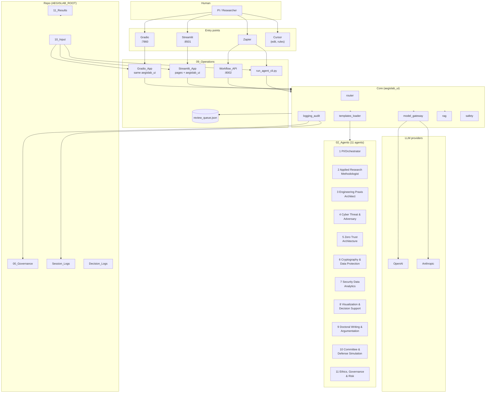
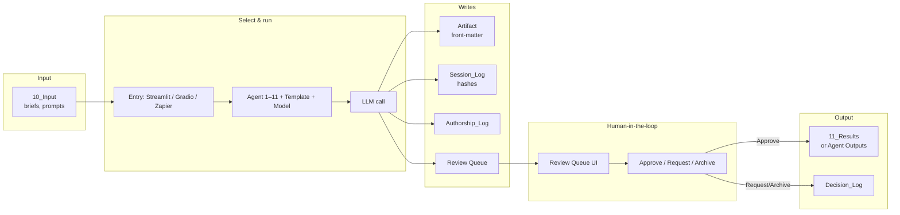

# AegisLab — Full Agentic AI Environment Workflow View

**Purpose:** Single view of the entire agentic AI environment: who interacts, which tools, how the 11 agents are invoked, where data and governance live, and how it all connects.

**Last Updated:** 2025-02-07

---

## 1. System boundary (everything in scope)



---

## 2. End-to-end data flow (agentic loop)



---

## 3. One-page ASCII: entire environment

```
┌─────────────────────────────────────────────────────────────────────────────────────────────┐
│                    AegisLab — Full Agentic AI Environment (workflow view)                      │
└─────────────────────────────────────────────────────────────────────────────────────────────┘

  PI / Researcher
        │
        ├──► Streamlit (localhost:8501)  ──► Dashboard | Run Agent | Review Queue | Audit | Settings
        ├──► Gradio (localhost:7860)     ──► Workflow (10_Input + Run Agent) | Review Queue | Session Logs
        ├──► Zapier                        ──► GitHub push notifications; Webhook → Workflow API (if exposed)
        └──► Cursor                       ──► Edit repo, rules, prompts; agents run via above UIs/CLI

                                        │
                                        ▼
  ┌─────────────────────────────────────────────────────────────────────────────────────────┐
  │  aegislab_ui (shared backend)                                                             │
  │  config · repo_validator · templates_loader · router · model_gateway · logging_audit     │
  │  metadata · safety · rag                                                                   │
  └─────────────────────────────────────────────┬───────────────────────────────────────────┘
                                                  │
          ┌──────────────────────────────────────┼──────────────────────────────────────┐
          ▼                                      ▼                                      ▼
  ┌─────────────────┐                  ┌─────────────────┐                  ┌─────────────────┐
  │  02_Agents (11)  │                  │  LLM gateway    │                  │  RAG (optional) │
  │  Role_Charter,   │                  │  OpenAI         │                  │  ChromaDB over  │
  │  Prompt_Templates│                  │  Anthropic      │                  │  governance +   │
  │  Daily Driver,   │                  │  (auto-route or │                  │  agents + logs  │
  │  Deep Dive,      │                  │   override)      │                  │                 │
  │  Review/QA       │                  └─────────────────┘                  └─────────────────┘
  └─────────────────┘
          │
          ▼
  ┌─────────────────────────────────────────────────────────────────────────────────────────┐
  │  Repo (AEGISLAB_ROOT)                                                                     │
  │  10_Input  →  trigger   │  02_Agents/XX_*/Outputs  │  11_Results  →  approved deliverables │
  │  00_Governance (Authorship_Log, AI_Use_Disclosure)  │  09_Operations/Session_Logs,         │
  │  Decision_Logs  │  Gradio_App/review_queue.json (shared queue)                           │
  └─────────────────────────────────────────────────────────────────────────────────────────┘
```

---

## 4. The 11 agents (02_Agents)

| # | Agent | Role_Charter + Prompt_Templates | Outputs |
|---|--------|---------------------------------|--------|
| 1 | PI/Orchestrator | Strategy, coordination, status | 02_Agents/01_PI_Orchestrator/Outputs/ |
| 2 | Applied Research Methodologist | Methods, evaluation criteria | 02_Agents/02_Applied_Research_Methodologist/Outputs/ |
| 3 | Engineering Praxis Architect | Architecture, design decisions | 02_Agents/03_Engineering_Praxis_Architect/Outputs/ |
| 4 | Cyber Threat & Adversary Analysis | Threats, ATT&CK, mitigations | 02_Agents/04_Cyber_Threat_Adversary_Analysis/Outputs/ |
| 5 | Cybersecurity Architecture & Zero Trust | Zero Trust, architecture | 02_Agents/05_Cybersecurity_Architecture_ZeroTrust/Outputs/ |
| 6 | Applied Cryptography & Data Protection | Crypto, algorithms | 02_Agents/06_Applied_Cryptography_DataProtection/Outputs/ |
| 7 | Security Data Analytics | Metrics, tool selection | 02_Agents/07_Security_Data_Analytics/Outputs/ |
| 8 | Visualization & Decision Support | Visuals, decision pathways | 02_Agents/08_Visualization_Decision_Support/Outputs/ |
| 9 | Doctoral Writing & Argumentation | Writing, argumentation | 02_Agents/09_Doctoral_Writing_Argumentation/Outputs/ |
| 10 | Committee & Defense Simulation | Defense prep, rebuttals | 02_Agents/10_Committee_Defense_Simulation/Outputs/ |
| 11 | Ethics, Governance & Risk | Ethics, risk register, governance | 02_Agents/11_Ethics_Governance_Risk/Outputs/ |

Each agent is selected at run time (Streamlit/Gradio/Zapier/CLI); one run = one agent + one template type (Daily Driver / Deep Dive / Review/QA) + one model (auto or override).

---

## 5. Entry points and what they do

| Entry | URL / command | Trigger run | Review queue | Audit / logs |
|-------|----------------|-------------|--------------|--------------|
| **Streamlit** | http://localhost:8501 | Run Agent (load 10_Input, then run) | Review Queue (+ Refresh from disk) | Governance Audit, Settings |
| **Gradio** | http://127.0.0.1:7860 | Workflow tab (load 10_Input, then run) | Review Queue tab | Session Logs tab, Settings |
| **Zapier** | zapier.com | GitHub push → notify; Webhook → Workflow API (if exposed) | — (use Streamlit/Gradio to review) | Session_Logs/ on disk |
| **Workflow API** | http://127.0.0.1:8002 | POST /run-agent (JSON body) | — | Same as Zapier |
| **CLI** | `python 09_Operations/scripts/run_agent_cli.py …` | Direct from shell/script | — | Same as Zapier |
| **Cursor** | IDE | No direct run; edit 02_Agents, 10_Input, scripts | — | Edit repo only |

---

## 6. Governance and persistence (always on)

| Item | Location | When updated |
|------|----------|--------------|
| Session log | 09_Operations/Session_Logs/YYYY-MM-DD_AgentXX_*.md | Every agent run (hashes, model, path) |
| Decision log | 09_Operations/Decision_Logs/ | Model override rationale; PI Approve / Request / Archive |
| Authorship log | 00_Governance/Authorship_Log.md | Every new artifact (AI/PI, status) |
| Review queue | 09_Operations/Gradio_App/review_queue.json | On run (add); on Approve/Request/Archive (remove). Shared Streamlit + Gradio + CLI. |
| Artifact front-matter | Every artifact file | Session_Date, Model_Used, PI_Review_Status, AI_Assisted, etc. |

---

## 7. RAG (optional augmentation)

- **Index:** Markdown from 00_Governance, 02_Agents, 03_Research_Methods, 04_Praxis_Artifact, Session_Logs, Decision_Logs.
- **Build:** Run Agent page → “Build RAG index” (once per repo change).
- **Use:** “Augment this run with retrieved context” → top-k chunks prepended to prompt before LLM call.
- **Tech:** ChromaDB + OpenAI text-embedding-3-small; index under Streamlit_App/rag_index/ (gitignored).

---

## 8. Links

| Doc | Purpose |
|-----|---------|
| [Environment_Architecture_View.md](../04_Praxis_Artifact/Architecture/Environment_Architecture_View.md) | Repo layers, Streamlit console, Run Agent flow, RAG, governance |
| [BPNA_Workflow.md](BPNA_Workflow.md) | BPMN-style process model (tasks, gateways, events) |
| [Workflow_Visual.md](Workflow_Visual.md) | 10_Input → Run Agent → Review Queue → 11_Results (Mermaid + ASCII) |
| [Streamlit_App/README.md](Streamlit_App/README.md) | How to run Streamlit — http://localhost:8501 |
| [Gradio_App/README.md](Gradio_App/README.md) | How to run Gradio — http://127.0.0.1:7860 |
| [Zapier_Workflows/README.md](Zapier_Workflows/README.md) | Zapier + Workflow API |
