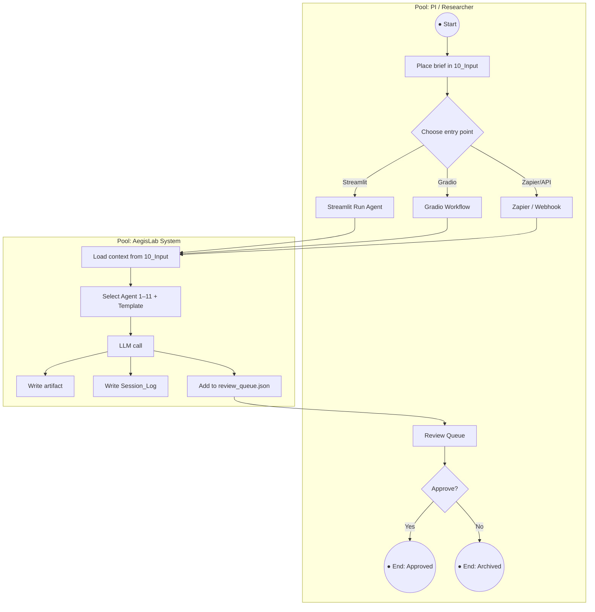
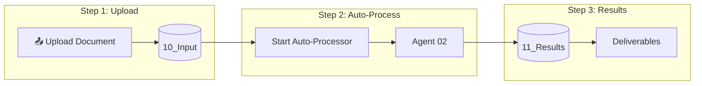

# AegisLab BPNA Workflow

**Purpose:** Business Process Model and Notation (BPMN-style) workflow for the AegisLab agentic research environment. Documents the end-to-end process from input to approved deliverables.

**Last Updated:** 2026-02-21

---

## Overview

| Element | Description |
|---------|--------------|
| **Process** | AegisLab Research Workflow |
| **Trigger** | Document placed in 10_Input |
| **Outcome** | PI-approved artifact in 11_Results |
| **Actors** | PI/Researcher, AI Agents (1–11) |

---

## BPMN Process Diagram

---

## Course Management BPNA (Dashboard Flow)

---

## Gateway Decisions

| Gateway | Condition | Path A | Path B |
|---------|-----------|--------|--------|
| Choose entry point | User preference | Streamlit | Gradio / Zapier |
| Approve? | PI decision | → 11_Results | → Decision_Log / Archive |
| Process input? | Files in 10_Input | Run Agent 02 | Skip / manual |

---

## Process Activities (BPMN Tasks)

| ID | Task | Lane | Implementation |
|----|------|------|-----------------|
| T1 | Place brief in 10_Input | PI | Manual: drag file or use Dashboard Upload |
| T2 | Load context | System | `run_agent_cli` / Streamlit / Gradio / API |
| T3 | Select Agent + Template | PI | UI or API `agent_num`, `template_type` |
| T4 | LLM call | System | `aegislab_ui` → OpenAI / Anthropic |
| T5 | Write artifact | System | `output_path` (e.g. 11_Results/*.md) |
| T6 | Add to Review Queue | System | `review_queue.json` |
| T7 | PI Review | PI | Streamlit / Gradio Review Queue tab |
| T8 | Approve / Archive | PI | Decision_Log, move to 11_Results or archive |

---

## Events

| Event | Type | Description |
|-------|------|--------------|
| E1 | Start | Document placed in 10_Input |
| E2 | End (Success) | Artifact approved → 11_Results |
| E3 | End (Archive) | Request changes or archive → Decision_Log |

---

## Integration Points

| System | Role | Endpoint / Path |
|--------|------|-----------------|
| Workflow API | HTTP trigger | POST /run-agent, POST /upload, POST /process-input |
| Dashboard | UI trigger | http://127.0.0.1:8002 |
| Zapier | Automation | Webhook → Workflow API |
| Auto-Processor | File watcher | `Start_Auto_Processor.bat` |

---

## Related Documentation

| Document | Purpose |
|----------|---------|
| [BPNA_Workflow_Bottleneck_Analysis.md](BPNA_Workflow_Bottleneck_Analysis.md) | Bottleneck analysis and mitigations |
| [Workflow_Visual.md](Workflow_Visual.md) | High-level flow (Mermaid + ASCII) |
| [Agentic_Environment_Workflow_View.md](Agentic_Environment_Workflow_View.md) | Full system view |
| [Zapier_Workflows/README.md](Zapier_Workflows/README.md) | Zapier automation |
| [Workflow_API/README.md](Workflow_API/README.md) | HTTP API reference |
