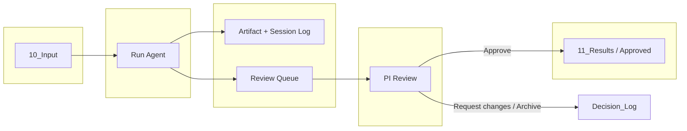
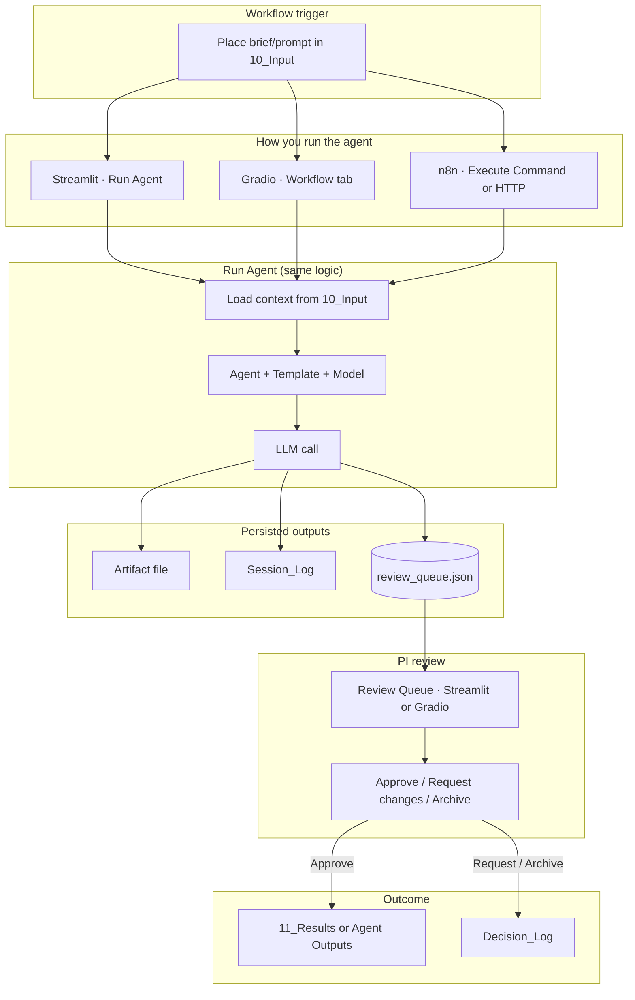

# AegisLab Workflow — Visual

**Purpose:** End-to-end flow from input to PI-approved deliverables. Same workflow whether you use Streamlit, Gradio, or n8n/CLI.

**Last Updated:** 2025-02-07

---

## High-level flow



---

## Detailed workflow (all entry points)



---

## One-page ASCII view

```
┌─────────────────────────────────────────────────────────────────────────────────┐
│                        AegisLab workflow (10_Input → PI-approved)                  │
└─────────────────────────────────────────────────────────────────────────────────┘

  ┌──────────────┐
  │  10_Input/   │   Briefs, prompts, context (e.g. brief.md)
  └──────┬───────┘
         │
         ▼
  ┌──────────────────────────────────────────────────────────────────────────────┐
  │  ENTRY POINTS (choose one)                                                     │
  │  • Streamlit (Run Agent) — Load from 10_Input → context → Run                   │
  │  • Gradio (Workflow tab) — Load from 10_Input → context → Run                   │
  │  • n8n — Execute Command (run_agent_cli.py) or HTTP (Workflow API /run-agent)   │
  └──────────────────────────────────────┬───────────────────────────────────────┘
                                         │
                                         ▼
  ┌──────────────────────────────────────────────────────────────────────────────┐
  │  RUN AGENT (aegislab_ui)                                                       │
  │  Agent (1–11) + Template (Daily Driver / Deep Dive / Review-QA) + Model        │
  │  → LLM call (OpenAI / Anthropic) → artifact written, session log, queue add   │
  └──────────────────────────────────────┬───────────────────────────────────────┘
                                         │
         ┌───────────────────────────────┼───────────────────────────────┐
         ▼                               ▼                               ▼
  ┌──────────────┐              ┌─────────────────┐              ┌──────────────────┐
  │  Artifact    │              │  Session_Logs/  │              │ review_queue.json │
  │  (e.g.       │              │  (hashes, meta)  │              │ (shared file)    │
  │  11_Results/ │              │                 │              │                   │
  │  *.md)       │              └─────────────────┘              └────────┬─────────┘
  └──────────────┘                                                        │
                                                                          ▼
  ┌──────────────────────────────────────────────────────────────────────────────┐
  │  REVIEW QUEUE (Streamlit or Gradio)                                           │
  │  • Refresh from disk (Streamlit) to see items from Gradio/CLI                 │
  │  • PI: Approve → front-matter + Decision_Log → remove from queue              │
  │  • Request changes / Archive → Decision_Log → remove from queue               │
  └──────────────────────────────────────┬───────────────────────────────────────┘
                                         │
         ┌───────────────────────────────┴───────────────────────────────┐
         ▼                                                               ▼
  ┌──────────────────┐                                          ┌──────────────┐
  │  11_Results/ or   │                                          │ Decision_Logs│
  │  committee-ready │                                          │ (audit trail) │
  └──────────────────┘                                          └──────────────┘
```

---

## Where to open what

| Step            | Streamlit              | Gradio                 | n8n / CLI                    |
|-----------------|------------------------|------------------------|-----------------------------|
| Trigger         | Run Agent → Load 10_Input | Workflow → Load 10_Input | CLI `--input 10_Input/…` or API |
| Run             | Run Agent → Run        | Run Agent → Run        | `run_agent_cli.py` or POST /run-agent |
| Review          | Review Queue (+ Refresh from disk) | Review Queue          | — (review in Streamlit/Gradio) |
| Audit           | Governance Audit       | Session Logs tab       | Session_Logs/ on disk       |

---

## Links

- **Full agentic environment:** [Agentic_Environment_Workflow_View.md](Agentic_Environment_Workflow_View.md) — entire AI environment (all entry points, 11 agents, governance, RAG).
- **Streamlit:** [09_Operations/Streamlit_App/README.md](Streamlit_App/README.md) — http://localhost:8501  
- **Gradio:** [09_Operations/Gradio_App/README.md](Gradio_App/README.md) — http://127.0.0.1:7860  
- **n8n:** [09_Operations/n8n_Workflows/README.md](n8n_Workflows/README.md)  
- **Environment architecture:** [04_Praxis_Artifact/Architecture/Environment_Architecture_View.md](../04_Praxis_Artifact/Architecture/Environment_Architecture_View.md)
