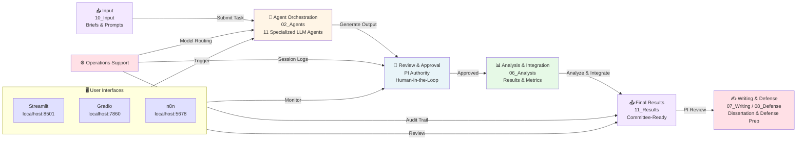
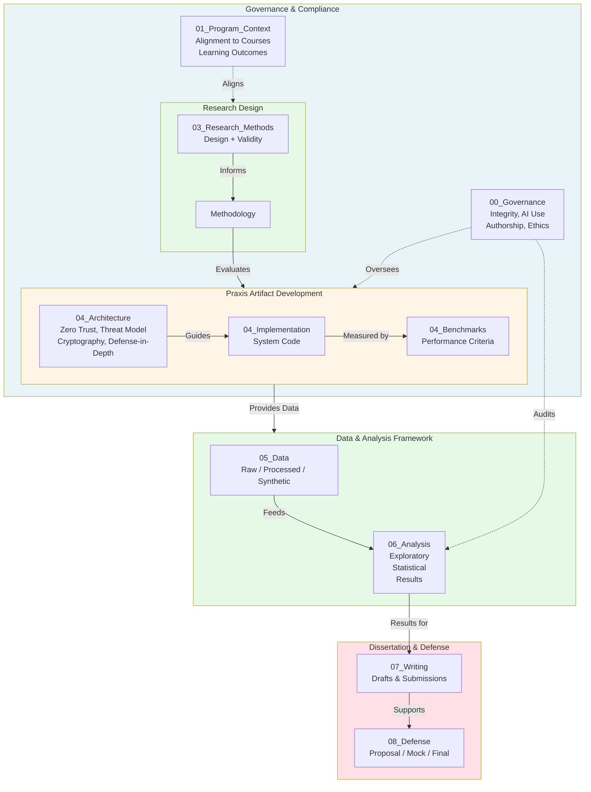

# AegisLab Architecture Diagram

## Project Overview

```mermaid
graph TB
    subgraph GOVERNANCE["🔐 Governance & Program Context"]
        GOV["00_Governance<br/>Integrity, AI Use, Authorship<br/>Ethics Approvals"]
        PROG["01_Program_Context<br/>Alignment Matrix<br/>Course Syllabi & Learning Outcomes"]
    end

    subgraph RESEARCH["📚 Research Foundation"]
        METHODS["03_Research_Methods<br/>Literature Reviews<br/>Research Design<br/>Validity Frameworks"]
        DATA["05_Data<br/>Raw / Processed / Synthetic<br/>Provenance Tracking"]
    end

    subgraph AGENTS["🤖 Agent Ecosystem - 11 Specialized Agents"]
        subgraph AGENT_CORE["Core Orchestration"]
            A01["Agent 01: PI Orchestrator<br/>(8499, 8188)"]
        end
        
        subgraph AGENT_METHODS["Methodology & Design"]
            A02["Agent 02: Applied Research<br/>Methodologist<br/>(8499, 8188, 8414)"]
            A03["Agent 03: Engineering<br/>Praxis Architect<br/>(8405, 8188, 8410, 8414)"]
        end
        
        subgraph AGENT_SECURITY["Security & Architecture"]
            A04["Agent 04: Cyber Threat &<br/>Adversary Analysis<br/>(8400, 8405, 8410, 8188)"]
            A05["Agent 05: Cybersecurity<br/>Architecture & Zero Trust<br/>(8405, 8414, 8188)"]
            A06["Agent 06: Applied<br/>Cryptography &<br/>Data Protection<br/>(8415, 8405, 8188)"]
        end
        
        subgraph AGENT_ANALYTICS["Analytics & Visualization"]
            A07["Agent 07: Security<br/>Data Analytics<br/>(8410, 8414, 8188)"]
            A08["Agent 08: Visualization &<br/>Decision Support<br/>(8410, 8414, 8188)"]
        end
        
        subgraph AGENT_WRITING["Writing & Defense"]
            A09["Agent 09: Doctoral Writing &<br/>Argumentation<br/>(8499, 8188)"]
            A10["Agent 10: Committee &<br/>Defense Simulation<br/>(8499, 8188)"]
            A11["Agent 11: Ethics,<br/>Governance & Risk<br/>(8499, 8188, 8414)"]
        end
    end

    subgraph ARTIFACT["🏗️ Praxis Artifact"]
        ARCH["04_Praxis_Artifact<br/>Architecture & Design<br/>Implementation<br/>Benchmarks & Documentation<br/>Zero Trust, Cryptography,<br/>Control Mapping"]
    end

    subgraph ANALYSIS["📊 Analysis & Results"]
        EXPL["06_Analysis<br/>Exploratory<br/>Statistical<br/>Results & Figures"]
    end

    subgraph WORKFLOW_IO["📥 Workflow I/O"]
        INPUT["10_Input<br/>Prompts & Briefs<br/>Staging Area"]
        OUTPUT["11_Results<br/>PI-Approved<br/>Committee-Ready<br/>Deliverables"]
    end

    subgraph WRITING_DEF["✍️ Writing & Defense"]
        WRITE["07_Writing<br/>Drafts<br/>Peer Reviews<br/>Final Submissions"]
        DEFENSE["08_Defense<br/>Proposal Defense<br/>Mock Defenses<br/>Final Defense Materials"]
    end

    subgraph OPERATIONS["⚙️ Operations & Tools"]
        OPS["09_Operations<br/>Model Routing<br/>Session & Decision Logs<br/>Tool Configurations"]
        
        subgraph UI_TOOLS["UI & Orchestration"]
            STREAMLIT["Streamlit Dashboard<br/>🖥️ localhost:8501<br/>Run Agents, Review Queue<br/>Governance Audit"]
            GRADIO["Gradio Workflow Manager<br/>🖥️ localhost:7860<br/>Input → Run → Review"]
            N8N["n8n Workflow Automation<br/>🖥️ localhost:5678<br/>Scheduling & Triggers"]
        end
    end

    subgraph MODELS["🧠 LLM Models - Model Routing"]
        SONNET["Claude Sonnet 4.5<br/>Daily Driver"]
        OPUS["Claude Opus 4.6<br/>Deep Dive & Review"]
        GPT["GPT-5.2<br/>Methodology & Architecture"]
    end

    %% Connections
    GOVERNANCE --> AGENTS
    RESEARCH --> AGENTS
    AGENTS --> ARTIFACT
    AGENTS --> ANALYSIS
    ARTIFACT --> EXPL
    
    INPUT --> AGENTS
    AGENTS --> OUTPUT
    
    AGENTS --> WRITE
    AGENTS --> DEFENSE
    AGENTS --> A11
    
    OPS --> STREAMLIT
    OPS --> GRADIO
    OPS --> N8N
    
    STREAMLIT --> AGENTS
    GRADIO --> AGENTS
    N8N --> AGENTS
    
    A01 --> A02
    A01 --> A03
    A02 --> MODELS
    A03 --> A04
    A04 --> A05
    A05 --> A06
    A07 --> A08
    A08 --> OUTPUT
    
    A11 --> OUTPUT
    
    MODELS -.->|Route| AGENTS

    %% Styling
    classDef governance fill:#e8f4f8,stroke:#2c5282,stroke-width:3px,color:#000
    classDef agents fill:#fff5e6,stroke:#d97706,stroke-width:3px,color:#000
    classDef artifact fill:#e6f9e6,stroke:#059669,stroke-width:3px,color:#000
    classDef workflow fill:#f3e8ff,stroke:#7c3aed,stroke-width:3px,color:#000
    classDef ops fill:#ffe0e6,stroke:#dc2626,stroke-width:3px,color:#000
    classDef models fill:#e0e0ff,stroke:#1e40af,stroke-width:3px,color:#000
    
    class GOVERNANCE governance
    class AGENTS,AGENT_CORE,AGENT_METHODS,AGENT_SECURITY,AGENT_ANALYTICS,AGENT_WRITING agents
    class ARTIFACT artifact
    class WORKFLOW_IO,INPUT,OUTPUT workflow
    class OPS,STREAMLIT,GRADIO,N8N,WRITE,DEFENSE ops
    class MODELS,SONNET,OPUS,GPT models
```

## Workflow Flow

## Data & Component Relationships

---

**Last Updated:** February 2026  
**Repository:** [AegisLab-doctoral-cyber-analytics](https://github.com/CyberVet13/Aegislab-doctoral-cyber-analytics)
